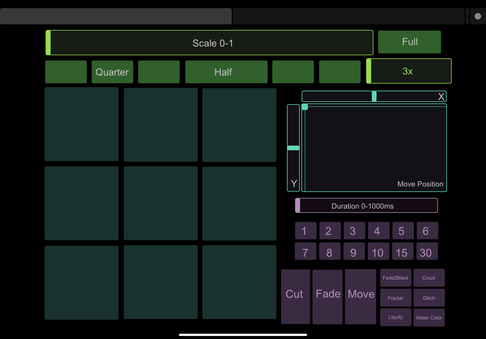

# NodeOBS-ZoomOSC-AutoCrop
## Uses [Node.js](https://nodejs.org/) to automatically crop Zoom meeting participants into individual 'Scenes' in [OBS](https://obsproject.com/) via ZoomOSC

### This is an add-on to the [Node-OBSosc](https://github.com/jshea2/Node-OBSosc) repository. Please refer to this for OSC to OBS commands documentation

#

## See It In Action! Video example from a production:

<a href="https://youtu.be/pR-0IUBodrc" target="_blank"></a>

#
### How it Works:
ZoomOSC sends an OSC message to Node.js with the amount of participants in the gallery view and which order they're in. Node.js uses the order and amount of participants and translates it to determine the crop of the 2nd display, depending how many and where the participants are. This updates everytime each participant turns on/off their video or the gallery view changes. This is sent via the OBS Websocket.


### Requires:

### [OBS](https://obsproject.com/), [obs-websocket](https://github.com/Palakis/obs-websocket/releases), [Node.js](https://nodejs.org/), [obs-websocket-js](https://github.com/haganbmj/obs-websocket-js), & [node-osc](https://github.com/MylesBorins/node-osc), [ZoomOSC](https://www.liminalet.com/zoomosc-downloads)


## Installation and Setup:

- Download and Install [OBS](https://obsproject.com/)
- Download and Install [obs-websocket](https://github.com/Palakis/obs-websocket/releases) plugin
- Download and Install [Node.js](https://nodejs.org/)
- Clone or Download this repository
- Open it preferred source code editor (ex. [Visual Studio Code](https://code.visualstudio.com/download) or Terminal/Command Prompt)
  - If you use Visual Studio Code...
  - Go to "View > Command Palette..."
  -  Type "Git: Clone" [Enter]
  -  Paste the Github Clone HTTPS URL. This is the same as the URL just with ".git" added to the end (https://github.com/jshea2/Node-OBSosc.git)
- Open code editor's Terminal
- Install obs-websocket-js & node-osc: `npm install` (Prepend `sudo` if on Mac)(Installs dependencies from 'package.json')
  
  
  
  or install seperately
  - `npm install obs-websocket-js`
  - `npm install node-osc`
  
  

  (Prepend `sudo` if on Mac)
 
 
 - In file 'Node-OBSosc.js' change config info.
 
  
  Configure this to match your OBS Websocket plugin:

``` javascript
//OBS Config
const obsIp = "127.0.0.1"
const obsPort = 4444;
const obsPassword = "secret"
```


Configure your OSC application to send to this IP and Port (Node recieves OSC Messages on this IP and Port and Converts to OBS Websocket):
``` javascript
//OSC Server (IN) Config
const oscServerIp = "127.0.0.1";
const oscPortIn = 3333;
```


Configure your OSC application to listen on this IP and Port (OBS Websocket sends to Node, then sends OSC Messages to this IP and Port):
```javascript
//OSC Client (OUT) Config
const oscClientIp = "127.0.0.1";
const oscPortOut = 53000;
```

Configure ZoomOSC application to send to this IP and Port (Node recieves OSC Messages on this IP and Port and Converts to OBS Websocket):
``` javascript
//ZoomOSC Server (IN) Config
const zoomOSCServerIp = "127.0.0.1";
const zoomOSCPortIn = 1234;
```


Configure ZoomOSC application to listen on this IP and Port (OSC sends to Node, then sends OSC Messages to this IP and Port on ZoomOSC):
```javascript
//ZoomOSC Client (OUT) Config
const zoomOSCClientIp = "127.0.0.1";
const zoomOSCPortOut = 8000;
```

- Save file, then Run "Node-OBSosc.js" in Terminal: 
    
    `node NodeOBS-ZoomOSC.js` 


  or  

  `npm start`

#
## Using NodeOBS-ZoomOSC

Once you run "NodeOBS-ZoomOSC.js" it will log IP and Port info, number of available scenes, a list of all scenes with numbers (see [Node-OBSosc]("https://github.com/jshea2/Node-OBSosc")), and OSC coming from ZoomOSC.

## Setting up ZoomOSC

***- A 2nd display is required for this to work***

***- Currently only a total of 9 participants are supported***

- Open ZoomOSC 

- Set it to "Gallery View"

- Set ZoomOSC to Fullscreen on 2nd display

- Find the "..." next to your own box and click "Hide Self View"

## Setting Up OBS

- Import and use the "OBS Scene-ZoomOSC.json" into your OBS Scene Collection. (This is included in the repository)
- The Scenes and Sources name must stay the same. The numbers correspond with the roles from ZoomOSC (If you want a participant to be a different number, then reorder the names in your ZoomOSC save.config file, then send a `/load` command to ZoomOSC to get the changes) 
#
## Setup and Signal Flow References:


#
## TouchOSC Control:
Manually moving around and scaling source's in OBS isn't the quickest or most accurate. This TouchOSC layout is made to quickly edit source's alignment, scale, position, transition type, and transition duration.
 
 *The .touchosc file is included with this repository.*


## Credits:
This was inspired by [Other Lonestar](https://www.youtube.com/watch?v=WUJUGsxdMEQ)'s Node-Red version.